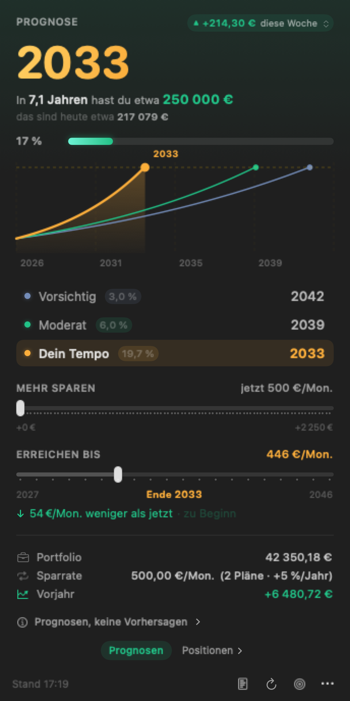
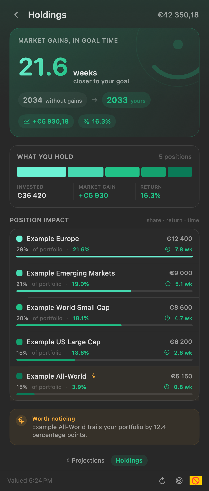
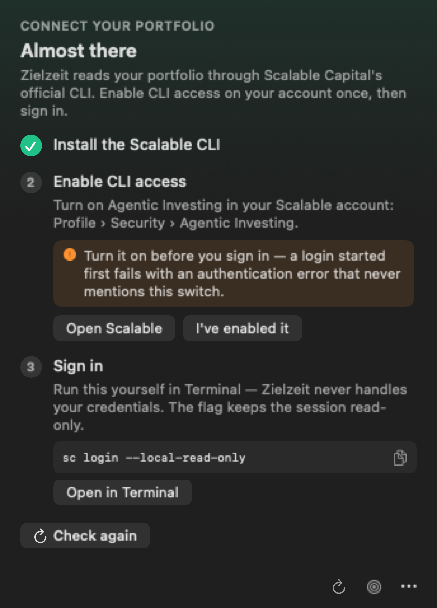
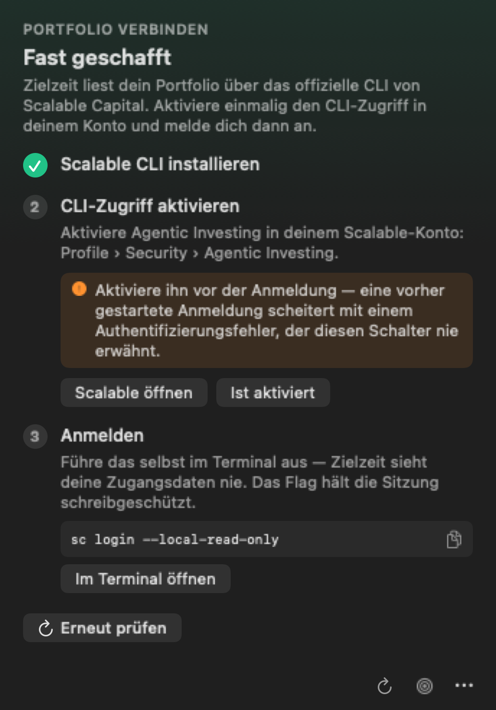

<p align="center">
  
</p>

<h1 align="center">Zielzeit</h1>

<p align="center">
  <strong>A Scalable Capital portfolio tracker for the macOS menu bar.</strong><br>
  <em>When will my portfolio reach my goal?</em>
</p>

<p align="center">
  
  
  <a href="https://github.com/Mannafee/zielzeit-scalable-capital/actions/workflows/ci.yml"></a>
  <a href="https://github.com/Mannafee/zielzeit-scalable-capital/actions/workflows/audit.yml"></a>
  
  
</p>

<p align="center">
  <!-- The .dmg assets across all releases, counted by GitHub on the way out and
       never by the app. From Scripts/usage-badges, published with the site. -->
  <a href="https://github.com/Mannafee/zielzeit-scalable-capital/releases"></a>
</p>

<p align="center">
  <a href="https://mannafee.github.io/zielzeit-scalable-capital/"><strong>zielzeit website ↗</strong></a>
</p>

---

<p align="center">
  <b>It reads your broker account, so here is the short version first.</b><br>
  Six read-only commands · no credentials, ever · no networking code at all<br>
  <sub><code>make audit</code> checks each of those against the source, in a fresh clone, with no build.
  <a href="#safety">Safety</a> · <a href="SECURITY.md">SECURITY.md</a></sub>
</p>

Zielzeit (German for "finish time") is a free, open-source macOS menu bar app for
[Scalable Capital](https://scalable.capital) investors. It answers one question: when will my
portfolio reach my goal?

It reads your broker account through the official
[Scalable Capital CLI](https://github.com/ScalableCapital/scalable-cli). Read-only, with no scraping,
no unofficial APIs and no credentials. From your balance, savings plan and trailing return it works
out a projected arrival year and keeps it in your menu bar.

<p align="center">
  <br>
  <em>17% of the way there, up on the week, projected to arrive in 2033.</em>
</p>

Clicking it opens the popover. Drag **Save more** and the year, the sentence and all three curves
move with it:

<p align="center">
  
</p>

Zielzeit speaks **English · Deutsch · Français · Español · Italiano**. It follows the first
supported language in your Mac's preferences by default, or you can choose one at any time from
the **Language** menu. The interface, numbers, dates, percentages, and euro placement all follow
the selected language.

The same popover, in German:

<p align="center">
  
</p>

Swipe sideways for your **positions**, measured in the same unit as everything else — time:

<p align="center">
  
</p>

The headline is the question this app exists to ask, asked of your gains: **how much sooner do you
arrive because of them?** Take each position's unrealised gain out of the total, re-run the
projection, and the difference is what that holding bought you — in weeks, and in the arrival year
itself when it moves one. Underneath, the whole portfolio as one bar, and every position with its
share, its return since purchase and its contribution in time.

<sub>Figures in every screenshot are synthetic demo data, not a real account.</sub>

## Safety

Zielzeit is read-only against your broker. It can run exactly six commands (`sc broker overview`,
`sc broker savings-plans`, `sc broker transactions`, `sc broker holdings`, `sc whoami` and
`sc installation-code`), enumerated in one Swift type with no other code path. There is no route to a trade, to any other
write command, or to `login`. Nothing leaves your Mac: no analytics, no network call of its own, no
account of any kind.

Every answer below names the file that backs it, so you can check rather than take it on faith — or
check all of them at once. This needs no Xcode, no account and no build, so you can run it before
you decide whether to download anything:

```sh
git clone https://github.com/Mannafee/zielzeit-scalable-capital
cd zielzeit-scalable-capital
make audit          # add AUDIT_ARGS=-v to see every search and its output
```

```
  ✓  broker write commands        none          the only broker verbs are overview, savings-plans, transactions, holdings
  ✓  broker commands enumerated   6             overview, savings-plans, transactions, holdings, whoami, installation-code
  ✓  networking code              none          no URLSession, Network.framework or socket API in the app
  ✓  shell invocation             none          one Process(), run by absolute path with an argument array
  ✓  credential access            none          no Keychain, no token, no read of the CLI's session
  ✓  values stored on disk        3             goal, language, hasRequestedAccess — no figures
  ✓  third-party dependencies     1             Sparkle, the updater — nothing else
```

`Scripts/audit` searches the source for each claim on this page and prints what it found, and the
[Audit workflow](https://github.com/Mannafee/zielzeit-scalable-capital/actions/workflows/audit.yml)
runs it on every push, so none of this can quietly drift away from the code. Whatever it cannot
check, [`SECURITY.md`](SECURITY.md) states plainly — including the two things that are true and not
reassuring.

### Can Zielzeit trade, sell, or move my money? **No.**

The six commands above are listed in `ScalableClient.Command`
([`Sources/ZielzeitCore/ScalableClient.swift`](Sources/ZielzeitCore/ScalableClient.swift)) and every
call site passes one of them. There is no code that builds a broker command from anything you type,
and no shell is involved — the CLI is executed directly through `Process`, not through a shell
string that could be made to mean something else.

The setup also asks you to sign in with `sc login --local-read-only`. That flag makes the *session
itself* read-only, enforced by the CLI, so the restriction survives even if you stop trusting this
app's word for it. It is
[Scalable Capital's own flag](https://github.com/ScalableCapital/scalable-cli#quick-start), not
something this project invented — and to quote their documentation rather than paraphrase it, the
guard is local: "This does not change token permissions or backend access." Write commands are
blocked in the CLI until you log in again without the flag.

```sh
grep -A20 'enum Command' Sources/ZielzeitCore/ScalableClient.swift
```

### Does Zielzeit ever see my Scalable Capital password or 2FA? **No.**

It never runs `sc login`, and that is deliberate. Signing in is an OAuth device-code flow you
complete yourself in Terminal and in your browser, which is what
[Scalable Capital's own documentation asks for](https://github.com/ScalableCapital/scalable-cli#quick-start):
*"For security and reliability, complete login yourself rather than via an AI agent."* Zielzeit shows
you the command and can open Terminal with it typed but *not* executed. No credential ever passes
through this app, and it never reads the session the CLI stores.

<details>
<summary><b>Does my portfolio data leave my Mac? No.</b></summary>

It cannot. Zielzeit contains no networking code at all — no `URLSession`, no sockets, no analytics
SDK, no telemetry, no crash reporter, and no account to sign up for. The only outbound traffic on
your machine is the official Scalable CLI talking to your broker, exactly as it does when you run it
yourself in Terminal.

```sh
grep -rn 'URLSession\|import Network\|NWConnection' Sources/   # returns nothing
```
</details>

<details>
<summary><b>What does it store on disk? Three values, and none of them a figure.</b></summary>

Three values in its own preferences domain, `com.zielzeit.Zielzeit`:

| Key | What it is |
|---|---|
| `goal` | Your goal amount, a number |
| `language` | `en`, `de`, `fr`, `es`, `it`, or absent for "follow the Mac" |
| `hasRequestedAccess` | Whether you have emailed for beta access, a true/false |

No balance, no holdings, no transactions, no name. Figures are fetched, shown, and forgotten when
the app quits. Everything it keeps can be read — and deleted — with `defaults`:

```sh
defaults read com.zielzeit.Zielzeit
make uninstall            # removes the app and the saved goal
```
</details>

<details>
<summary><b>Why does macOS say it "cannot be checked for malicious software"? Because it is not notarized.</b></summary>

Because the download is ad-hoc signed but not *notarized*, and notarization requires a paid Apple
Developer account this project does not have. The warning is about the absence of that receipt, not
about anything found in the app — Apple has not inspected it either way.

That is a real limitation and worth weighing. If you would rather not rely on it, build from source;
it is one command and takes under a minute.

```sh
codesign -dv /Applications/Zielzeit.app     # Identifier=com.zielzeit.Zielzeit, Signature=adhoc
```
</details>

<details>
<summary><b>Is it sandboxed? No, and it cannot be.</b></summary>

No, and it cannot be. A sandboxed app cannot launch another program, and Zielzeit's whole job is to
run the Scalable CLI you installed. Being straight about that matters more than the reassurance:
Zielzeit runs with your normal user permissions. What limits it is that it is small, open, and
readable end to end — not an OS boundary.
</details>

<details>
<summary><b>How do I verify all of this myself? <code>make audit</code>, then read the five files it names.</b></summary>

Every claim here is checkable in a few minutes, and the repository is built so it stays that way:

```sh
git clone https://github.com/Mannafee/zielzeit-scalable-capital && cd zielzeit-scalable-capital
make audit AUDIT_ARGS=-v     # every claim above, with the search behind each one
make test && make run        # your build, your machine
```

`make audit` is a shell script (`Scripts/audit`) and short enough to read before you run it, which is
the point: it prints the searches as it goes, so you are checking the source rather than trusting the
script. It reads `Sources/` only — a check that also matched the README would pass on the strength of
the promise instead of the code.

The test suite runs against payloads *shaped* from real CLI responses and never real ones: a CI job
fails the build if anything resembling a real balance, contribution, installation code or ISIN
appears in the repository. That check protects contributors' accounts, and it is also why you can
read every fixture here without seeing anyone's holdings.
</details>

## What it does

- **A projected year in your menu bar.** A progress ring with your percentage inside it, the year
  beside it, and a caret showing which way the market moved. No window to open, no tab to keep.
- **Three scenarios on one chart.** Cautious (3%), moderate (6%), and your pace: the return your
  portfolio actually achieved over the trailing year, measured with the
  [simple Dietz method](https://en.wikipedia.org/wiki/Simple_Dietz_method) against your real deposits.
  The headline year uses your pace, so it moves with how you are actually doing.
- **Two what-if sliders.** "Save more" previews what an extra €200/mo does to every projection, live.
  "Reach by" inverts the question and tells you the monthly contribution that hits a year you pick.
- **Inflation, stated plainly.** The goal restated in today's money at the projected horizon, on
  screen rather than behind a toggle.
- **Market movement.** Tap the chip to cycle the window: today, this week, this month, 3 months,
  6 months, past year. The window is always named, because the sign differs between them.
- **Caveats that match the numbers.** The disclaimer quotes the rate, contribution and goal actually
  on screen.
- **Your positions, measured in time.** Swipe from the projection to a second page that converts each
  position's gain into how much earlier it brings the goal — the same conversion the whole app is
  built on, applied one holding at a time. Alongside it: the whole portfolio as one bar with what you
  paid against what the market added, and each position's share, return since purchase and
  contribution in weeks. It flags a holding whose return is well off the portfolio's own, and says by
  how much.

## Requirements

- macOS 15 (Sequoia) or later, on Apple silicon or Intel
- A Scalable Capital brokerage account
- The official Scalable CLI (`sc`), installed with [Homebrew](https://brew.sh), allowlisted by
  Scalable Capital and logged in. The app walks you through all three on first launch.
- Xcode 16 or later, or an equivalent Swift 6 toolchain, if you build from source

## Download and install

**[⬇︎ Download Zielzeit.dmg](https://github.com/Mannafee/zielzeit-scalable-capital/releases/latest/download/Zielzeit.dmg)**
(or browse [all releases](https://github.com/Mannafee/zielzeit-scalable-capital/releases/latest)). It is a
universal build, so it runs on Apple silicon and Intel, and you do not need Xcode.

1. Open the downloaded `Zielzeit.dmg` and drag Zielzeit onto the Applications folder.
2. Open Zielzeit from Applications. The first launch will be blocked. See below.
3. Look for the progress ring in your menu bar.

Or from Homebrew, which is where you will be installing the Scalable CLI anyway:

```sh
brew install --cask mannafee/tap/zielzeit
```

That is one command instead of a download and a drag, and it is **not** a way around the
first-launch warning below — the app is not notarized either way. ([Why the tap exists, and what it
does not claim.](https://github.com/Mannafee/homebrew-tap))

Zielzeit keeps itself up to date. Later versions install quietly in the background, so this is the
only time you download anything; the new version takes effect the next time you quit and reopen
Zielzeit. The `…` menu in the popover shows which version you are on, and `Check for updates` there
asks immediately if you would rather not wait.

Connecting it to your account then takes two Terminal commands and an email to Scalable Capital,
which is [explained below](#one-terminal-step-you-cannot-avoid) and which the app walks you through.

### The first-launch warning is expected

macOS will say Zielzeit "cannot be opened because Apple cannot check it for malicious software."
Nothing is wrong with the download. Zielzeit is signed, but it is not notarized, and notarization
requires a paid Apple Developer account that this free project does not have.

To open it anyway:

> Go to **System Settings → Privacy & Security**, scroll to the bottom, and click **Open Anyway**
> next to the message about Zielzeit. Confirm with Touch ID or your password.

You only do this once. If you would rather not, [build it from source](#build-it-yourself) instead.
A locally built app is never flagged.

### One Terminal step you cannot avoid

Zielzeit reads your portfolio through Scalable Capital's official command-line tool, and Scalable
requires that you install it and sign in yourself, so the app is never given your credentials. Even
with the download, there is a one-time setup involving Terminal. Zielzeit walks you through it with
copy buttons for every command, but it is fair to know before you start. See
[Connecting to Scalable Capital](#connecting-to-scalable-capital).

Right-click the menu bar item for Launch at login, refresh, and quit.

## Build it yourself

Compiling takes about a minute and avoids the Gatekeeper prompt.

```sh
git clone https://github.com/Mannafee/zielzeit-scalable-capital.git
cd zielzeit-scalable-capital
make run          # builds Zielzeit.app, ad-hoc signs it, and launches it
```

To keep it around permanently:

```sh
make install      # copies it to /Applications; needs an admin account
```

> `/Applications` is owned by `root:admin`, so on a standard (non-admin) macOS account `make install`
> fails on the copy. Use `sudo make install`, or just `make run` from the clone. The app works fine
> from anywhere.

`make uninstall` removes the app and the saved goal.

## Connecting to Scalable Capital

The Scalable CLI is in beta and gated: Scalable Capital has to allowlist your machine before it can
log in at all. That is a human round-trip that cannot be automated, so Zielzeit makes every step
around it one tap.

<p align="center">
  
</p>

<details>
<summary>Auf Deutsch</summary>
<p align="center">
  
</p>
</details>

1. **Install the CLI.** A copy button for `brew tap ScalableCapital/tap && brew install scalable-cli`.
2. **Request beta access.** Zielzeit reads your installation code, and the Request access button
   opens a prefilled email to `cli.beta@scalable.capital`. Nothing to compose.
   ⚠️ **Send it from the email address registered with Scalable Capital.** They match the request to
   your account by sender, and a request from any other address is silently never answered. A
   `mailto:` link opens your default mail account, which often is not that one, so check the From
   field.
3. **Sign in.** Run `sc login --local-read-only` yourself in Terminal. Zielzeit shows the command and
   can open Terminal with it typed but not executed.

Then set your goal. `100000`, `100.000`, `€100 000` and `100k` all parse. German, French,
Spanish, and Italian display continental number formatting with the euro sign after the amount:
`42 350,18 €`.

### Three things Zielzeit will not do

- **Bundle the CLI.** Apache 2.0 would permit it, but Scalable's own guidance is to trust only
  official artifacts, and a broker binary shipped inside a third-party app is what that warns against.
- **Run `sc login`.** It is an OAuth device-code flow and it is yours to complete. The app never sees
  your credentials.
- **Skip `--local-read-only`.** That flag stores the session in locally enforced read-only mode, which
  makes the read-only promise structural rather than editorial.

## The icons

<p align="center">
  
</p>

Both icons are drawn in code rather than shipped as image files, so they stay crisp at any size and
are tuned in one place.

- **Menu bar.** A progress ring with your percentage inside it, filling as you approach your goal and
  becoming a checkmark when you get there. The caret beside it is emerald when the market is up, red
  when it is down, and absent when it has not moved. `make icons` renders every state, magnified.
- **App icon.** The same ring, glowing on a dark squircle. *Ziel* is German for target, so the mark is
  a target. `make icon` regenerates `Zielzeit.icns`.

## How the projection works

Your realized return uses the simple Dietz method, which approximates average invested capital by
assuming contributions arrive evenly through the year:

```
rate = gain₁ᵧ / (total − gain₁ᵧ − contributions/2)
```

Contributions are measured rather than guessed: Zielzeit walks the trailing year of
`sc broker transactions` and sums deposits less withdrawals. Securities movements are excluded,
because a custody migration would otherwise look like a year's worth of deposits. The rate is clamped
to ±30%, and suppressed entirely when the capital base works out to zero or less. That happens for a
portfolio younger than a year, where deposits rather than growth explain the balance.

Time to goal solves the monthly-compounding balance equation for `t`:

```
t = ln((G·r + P) / (V·r + P)) / ln(1 + r)
```

where `r` is the monthly rate (converted geometrically, `(1+annual)^(1/12) − 1`), `P` the monthly
contribution, `V` the current value and `G` the goal. If your savings plan has dynamization, the
annual step-up Scalable applies, the contribution becomes a step function that the closed form cannot
express. Zielzeit then walks forward one twelve-month block at a time and applies the same formula at
each year's contribution. That stays exact, and it is conservative about when the raise lands, since
the API does not say.

The chart plots the same recurrence forward, and a test asserts that each curve meets the goal line at
exactly the month the formula returns. That cross-check keeps the chart and the headline from
disagreeing.

**These are projections, not predictions.** They assume a constant return, smooth compounding and an
uninterrupted savings plan, none of which is how markets or life work. Before tax. Not financial
advice.

## Contributing

Contributions are welcome. [CONTRIBUTING.md](CONTRIBUTING.md) covers the architecture, the make
targets, the UI harnesses, and how to exercise every state without touching a real account.

The short version:

```sh
make test     # 251 unit tests, all in ZielzeitCore
make once     # print the report as text, the fastest check of the numbers
make ui       # rasterize the popover, light and dark
make help     # every target
```

One rule matters more than the rest: all arithmetic lives in `ZielzeitCore` and all UI in `Zielzeit`.
No `import SwiftUI` in the core, no math in the views. That split is what makes the projections
testable and the harnesses possible.

If Zielzeit is useful to you, a ⭐ on the repository is the cheapest way to say so, and it is what
helps other Scalable Capital investors find it.

## Disclaimer

Zielzeit is an independent, unofficial open-source project. It is not affiliated with, endorsed by, or
supported by Scalable Capital GmbH. "Scalable Capital" is their trademark, used here only to describe
what this app reads. Use at your own risk. The figures it shows are projections, and nothing in it is
financial advice.

## License

[MIT](LICENSE) © Istiaque Mannafee Shaikat

---

<sub>Keywords: Scalable Capital · scalable-cli · macOS menu bar app · portfolio tracker ·
investment goal calculator · FIRE calculator · compound interest projection · savings plan ·
Sparplan · Depot · ETF portfolio · Dietz return · Swift · SwiftUI · Swift Charts</sub>
